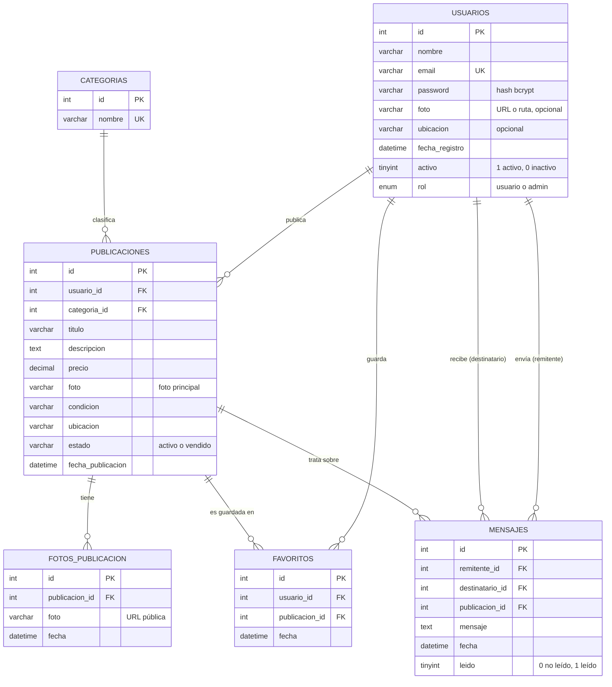

# Modelo entidad-relación — SHOPPY T&M

Base de datos **MySQL** (motor InnoDB, `utf8mb4`). El script completo está en [05-base-de-datos/shoppy_tm.sql](../05-base-de-datos/shoppy_tm.sql).

## Diagrama

## Entidades

### USUARIOS
Personas registradas en la plataforma. Un mismo usuario puede comprar y vender.

| Atributo | Tipo | Restricciones | Descripción |
|---|---|---|---|
| `id` | INT | PK, AUTO_INCREMENT | Identificador. |
| `nombre` | VARCHAR(120) | NOT NULL | Nombre completo. |
| `email` | VARCHAR(190) | NOT NULL, UNIQUE | Correo; se usa para iniciar sesión. |
| `password` | VARCHAR(255) | NOT NULL | Hash bcrypt de la contraseña (nunca texto plano). |
| `foto` | VARCHAR(255) | NULL | Foto de perfil (URL de Vercel Blob o `uploads/...`). |
| `ubicacion` | VARCHAR(190) | NULL | Ciudad o municipio. |
| `fecha_registro` | DATETIME | DEFAULT CURRENT_TIMESTAMP | Fecha de registro. |
| `activo` | TINYINT(1) | NOT NULL, DEFAULT 1 | Si la cuenta puede iniciar sesión. |
| `rol` | ENUM('usuario','admin') | NOT NULL, DEFAULT 'usuario' | Nivel de permisos. |

### CATEGORIAS
Clasificación de los productos (Tecnología, Hogar, Ropa y Accesorios, Deportes, Vehículos, Entretenimiento, Libros, Otros).

| Atributo | Tipo | Restricciones |
|---|---|---|
| `id` | INT | PK, AUTO_INCREMENT |
| `nombre` | VARCHAR(120) | NOT NULL, UNIQUE |

### PUBLICACIONES
Productos publicados para la venta.

| Atributo | Tipo | Restricciones | Descripción |
|---|---|---|---|
| `id` | INT | PK, AUTO_INCREMENT | Identificador (se usa en el enlace `/producto/ID`). |
| `usuario_id` | INT | FK → usuarios.id, NOT NULL | Vendedor (dueño). |
| `categoria_id` | INT | FK → categorias.id, NOT NULL | Categoría. |
| `titulo` | VARCHAR(200) | NOT NULL | Título. |
| `descripcion` | TEXT | NOT NULL | Descripción. |
| `precio` | DECIMAL(12,2) | NOT NULL, DEFAULT 0 | Precio en pesos colombianos. |
| `foto` | VARCHAR(255) | NULL | Foto principal (primera de la galería). |
| `condicion` | VARCHAR(80) | NOT NULL | Nuevo, Como nuevo, Buen estado, Usado. |
| `ubicacion` | VARCHAR(190) | NOT NULL | Lugar de entrega. |
| `estado` | VARCHAR(40) | NOT NULL, DEFAULT 'activo' | `activo` o `vendido`. |
| `fecha_publicacion` | DATETIME | DEFAULT CURRENT_TIMESTAMP | Fecha de publicación. |

### FOTOS_PUBLICACION
Galería de fotos de cada publicación.

| Atributo | Tipo | Restricciones |
|---|---|---|
| `id` | INT | PK, AUTO_INCREMENT |
| `publicacion_id` | INT | FK → publicaciones.id, ON DELETE CASCADE |
| `foto` | VARCHAR(255) | NOT NULL |
| `fecha` | DATETIME | DEFAULT CURRENT_TIMESTAMP |

### FAVORITOS
Publicaciones guardadas por cada usuario (tabla intermedia N:M entre usuarios y publicaciones).

| Atributo | Tipo | Restricciones |
|---|---|---|
| `id` | INT | PK, AUTO_INCREMENT |
| `usuario_id` | INT | FK → usuarios.id, ON DELETE CASCADE |
| `publicacion_id` | INT | FK → publicaciones.id, ON DELETE CASCADE |
| `fecha` | DATETIME | DEFAULT CURRENT_TIMESTAMP |
| — | — | UNIQUE (`usuario_id`, `publicacion_id`) |

### MENSAJES
Conversaciones entre comprador y vendedor sobre una publicación.

| Atributo | Tipo | Restricciones |
|---|---|---|
| `id` | INT | PK, AUTO_INCREMENT |
| `remitente_id` | INT | FK → usuarios.id, ON DELETE CASCADE |
| `destinatario_id` | INT | FK → usuarios.id, ON DELETE CASCADE |
| `publicacion_id` | INT | FK → publicaciones.id, ON DELETE CASCADE |
| `mensaje` | TEXT | NOT NULL |
| `fecha` | DATETIME | DEFAULT CURRENT_TIMESTAMP |
| `leido` | TINYINT(1) | NOT NULL, DEFAULT 0 |

## Relaciones y cardinalidad

| Relación | Cardinalidad | Descripción |
|---|---|---|
| Usuario — Publicación | 1 : N | Un usuario publica muchas publicaciones; cada publicación tiene un único dueño. |
| Categoría — Publicación | 1 : N | Una categoría agrupa muchas publicaciones; cada publicación pertenece a una categoría. |
| Publicación — Foto | 1 : N | Una publicación tiene varias fotos (hasta 10 por envío); al borrarla se borran sus fotos. |
| Usuario — Publicación (favoritos) | N : M | Resuelta con la tabla `favoritos`; un usuario no puede guardar dos veces la misma publicación. |
| Usuario — Mensaje (remitente) | 1 : N | Un usuario envía muchos mensajes. |
| Usuario — Mensaje (destinatario) | 1 : N | Un usuario recibe muchos mensajes. |
| Publicación — Mensaje | 1 : N | Cada mensaje trata sobre una publicación. |

## Reglas de negocio reflejadas en el modelo

- Solo el dueño (`publicaciones.usuario_id`) o un usuario con `rol = 'admin'` puede editar o eliminar una publicación; esto se valida en el backend.
- Solo el dueño puede cambiar `estado` a `vendido`.
- Las publicaciones con `estado = 'vendido'` no aparecen en el catálogo ni en favoritos.
- Al eliminar una publicación se eliminan sus fotos, favoritos y mensajes.
- `usuarios.rol` solo se modifica con el script del servidor (`npm run rol:admin`).
